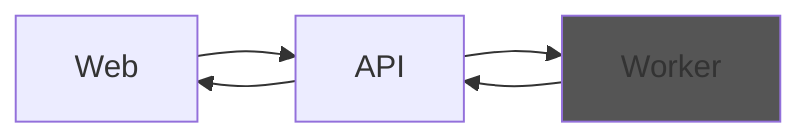
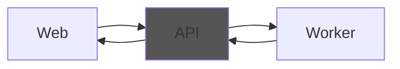
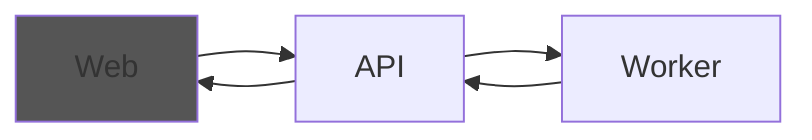

# Microservice Architecture Templates

This project contains a set of templates to build an application following specific microservice architecture guidelines that have evolved over the years

[](https://www.nuget.org/packages/MSA.Templates/)
[](https://github.com/ftechmax/msa-templates/actions/workflows/release.yml)
[](https://codecov.io/gh/ftechmax/msa-templates)

## Table of contents

- [Microservice Architecture Templates](#microservice-architecture-templates)
  - [Table of contents](#table-of-contents)
  - [Template Installation](#template-installation)
  - [Quick start](#quick-start)
  - [Microservice Architecture Worker](#microservice-architecture-worker)
  - [Microservice Architecture API](#microservice-architecture-api)
  - [Microservice Architecture Web](#microservice-architecture-web)
  - [How to contribute](#how-to-contribute)

## Template Installation

Install the latest version of the `MSA.Templates` package:

```console
dotnet new install MSA.Templates
```

## Quick start

using the script

```console
.\generator.ps1 `
-ServiceName Awesome `
-RabbitMqUserSecret rabbitmq-default-user `
-MongoDbUserSecret mongodb-admin-user `
-RedisServiceName redis `
-RedisServiceNamespace redis-system `
-DestinationFolder c:/git
```

or manually

```console
mkdir -p c:/git/awesome/src
cp ./k8s c:/git/awesome/
cd c:/git/awesome/src
dotnet new msa-shared -n Awesome -o shared
dotnet new msa-worker -n Awesome -o worker
dotnet new msa-api -n Awesome -o api
dotnet new msa-web -n Awesome -o web
```

## Microservice Architecture Worker

This creates a layered .net application specifically designed for handling domain events and is preconfigured to run in a Kubernetes environment.



To create a worker execute the following command, replacing `Awesome` with your domain name (e.g. `Accounting` or `Products`):

```console
dotnet new msa-worker -n Awesome -o worker
```

> :rocket: Check the wiki about [worker services](https://github.com/ftechmax/msa-templates/wiki/worker-service) for details about setting up and using this service type.

## Microservice Architecture API

This creates a layered .net 6 application specifically designed for handling API calls and generating domain commands and is preconfigured to run in a Kubernetes environment.



To create an api execute the following command, replacing `Awesome` with your domain name (e.g. `Accounting` or `Products`):

```console
dotnet new msa-api -n Awesome -o api
```

> :rocket: Check the wiki about [api services](https://github.com/ftechmax/msa-templates/wiki/api-service) for details about setting up and using this service type.

## Microservice Architecture Web

This creates a blank Angular Next application hosted in a nginx container and is preconfigured to run in a Kubernetes environment and uses [Transloco](https://ngneat.github.io/transloco/) to manage translations.



To create an api execute the following command, replacing `Awesome` with your domain name (e.g. `Accounting` or `Products`):

```console
dotnet new msa-web -n Awesome -o web
```

> :rocket: Check the wiki about [web services](https://github.com/ftechmax/msa-templates/wiki/web-service) for details about setting up and using this service type.

## How to contribute

Feel free to create a PR if you feel something is missing!
