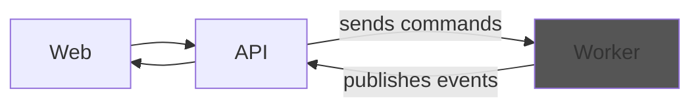
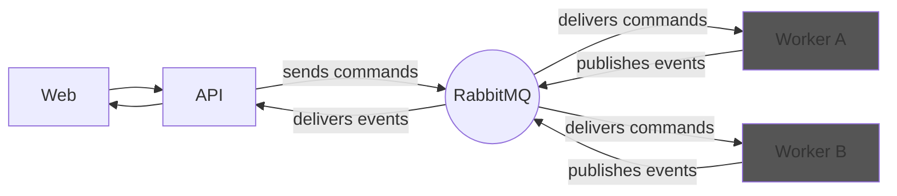
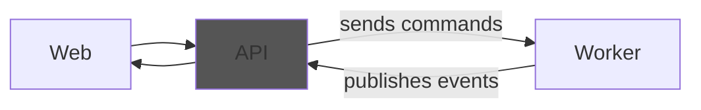
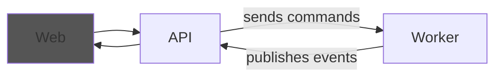

# Message-driven Service Architecture Templates

This project contains a set of templates to scaffold a small message-driven system: a **Web** frontend, an **API**, a **Worker**, and a **Shared** project for contracts.

In this repository, **MSA** stands for **Message-driven Service Architecture**: services communicate primarily through commands and events over a message broker, which keeps them loosely coupled and enables independent scaling and deployment.

If you're new here, start with [Quick start](#quick-start), then read [What you get](#what-you-get). The service-specific sections below explain the responsibilities and the reasoning behind the split.

[](https://www.nuget.org/packages/MSA.Templates/)
[](https://github.com/ftechmax/msa-templates/actions/workflows/release.yml)
[](https://codecov.io/gh/ftechmax/msa-templates)

> [!NOTE]
> The templates currently use **MassTransit**, but this will be removed in a future update and replaced by my own library **Conveyo**: https://github.com/ftechmax/conveyo
> MassTransit's licensing model changed, and I want the messaging stack to remain fully open and free.

## Table of contents

- [Message-driven Service Architecture Templates](#message-driven-service-architecture-templates)
  - [Table of contents](#table-of-contents)
  - [Why this exists](#why-this-exists)
  - [Quick start](#quick-start)
  - [What you get](#what-you-get)
  - [Message-driven Service Architecture Worker](#message-driven-service-architecture-worker)
  - [Message-driven Service Architecture API](#message-driven-service-architecture-api)
  - [Message-driven Service Architecture Web](#message-driven-service-architecture-web)
  - [How to contribute](#how-to-contribute)

## Why this exists

I've been building message-driven systems for ~15 years. Over time you end up rediscovering the same handful of patterns: how services talk to each other, how you model commands and events, how you make failures visible, how you deploy safely, and how you keep a system operable once it's running 24/7.

These templates are the accumulation of those lessons, packaged as a starting point that gets the boring, but critical, parts right:

- A clear split between the **HTTP edge** in the API and **asynchronous domain work** in the worker
- A default stack for **messaging, persistence, caching, and telemetry** that works well in practice
- **Kubernetes** manifests are included so you can deploy quickly on local, self-hosted, or cloud environments
- **Opinionated but flexible** architecture that encourages best practices without being restrictive

This is not meant to be the only way to do things. It's just a set of defaults that has proven itself in real projects, real incidents, and real deployments.

## Quick start

Install the latest version of the `MSA.Templates` package:

```console
dotnet new install MSA.Templates
```

To use the generator script, clone this repository and run `generator.ps1` with the required parameters:

```console
.\generator.ps1 `
-ServiceName AwesomeApp `
-RabbitMqUserSecret rabbitmq-default-user `
-DestinationFolder c:/git
```

This will create a folder `c:/git/awesome-app` with the following structure:

```
awesome-app
|-- k8s
|-- src
|   |-- api
|   |-- shared
|   |-- cache
|   |-- web
|   `-- worker
`-- krun.json
```

## What you get

These templates are intended to be used together as a "vertical slice" of a message-driven system:

- **Shared**: contracts and shared abstractions used across services within the same domain.
- **Worker**: consumes commands and external events, applies business logic, persists state, and publishes domain events.
- **API**: serves HTTP endpoints, validates input, sends commands to the worker, and fans out updates through SignalR.
- **Web**: a blank Angular frontend scaffolded to work with the API.
- **Kubernetes manifests** for deploying the API, Worker and Web to any Kubernetes cluster.
- **krun** config files for usage with the [krun](https://github.com/ftechmax/krun) development tool.

The templates come with sensible defaults for:

- **Messaging** via MassTransit (Conveyo coming soon!) + RabbitMQ for commands and events
- **Persistence** via MongoDB.Driver package
- **Caching** via Valkey/Redis using the StackExchange.Redis package
- **Real-time updates** via SignalR
- **Observability** via OpenTelemetry for traces, metrics, and logs

## Message-driven Service Architecture Worker

The worker is the service that **consumes commands/events**, runs domain logic, persists state, and **publishes domain events**. It is preconfigured for Kubernetes and designed to be idempotent, observable, and resilient.

For the full breakdown of the project structure and handler patterns, see [docs/worker.md](docs/worker.md).



In real systems you often end up with **multiple workers**, typically split by domain or bounded context. The important bit is that they stay independent: each worker consumes its own commands, owns its own state, and can react to events published by other workers.

Here's a common "two workers" setup. The API sends commands onto the bus, and both workers publish events back. Workers can also subscribe to each other's events without direct coupling.



## Message-driven Service Architecture API

The API is the **HTTP edge**: it validates input, serves reads from a local read model, and forwards writes as **commands to the worker** over the message bus. It also consumes events to invalidate caches and notify clients (SignalR).

For the full breakdown of controllers, application services, and local event handling, see [docs/api.md](docs/api.md).



## Message-driven Service Architecture Web

This creates a simple Angular SPA hosted in an Nginx container and preconfigured to run in a Kubernetes environment. It uses [Transloco](https://ngneat.github.io/transloco/) to manage translations.

The web template is kept intentionally light, but it's meant to fit the flow:

- **Calls the API** for queries and user-initiated actions.
- **Triggers commands** indirectly by hitting HTTP endpoints. The API turns those requests into messages.
- **React to server-side changes**: the architecture supports pushing updates through SignalR so your UI can subscribe to events and refresh relevant screens.
- **Deploys cleanly** as a static-ish frontend behind Nginx, which maps nicely to Kubernetes.

The goal is to give you a working starting point that matches the rest of the stack, without forcing a specific UI architecture on top.



## How to contribute

Feel free to create an issue or pull request if you feel something is missing!
