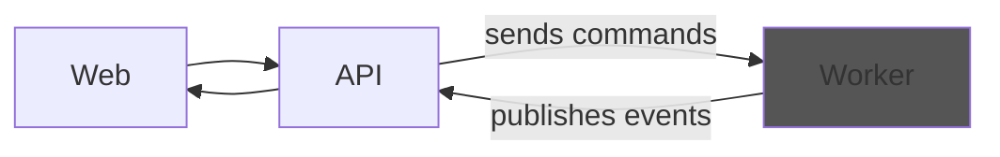
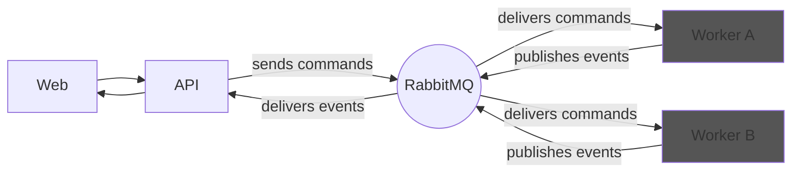
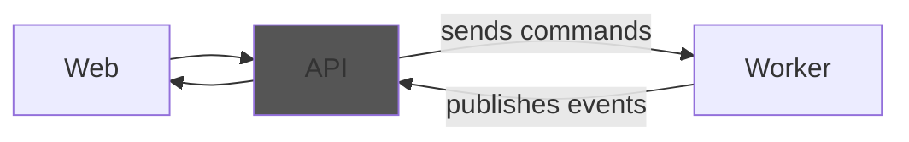
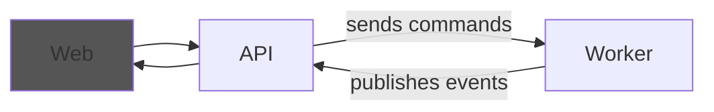

# Message-driven Service Architecture Templates

This project contains a set of templates to scaffold a small message-driven system: a **Web** frontend, an **API**, a **Worker**, and a **Shared** project for contracts.

In this repository, **MSA** stands for **Message-driven Service Architecture**: services communicate primarily through commands and events over a message broker, which keeps them loosely coupled and enables independent scaling and deployment.

If you're new here, start with [Quick start](#quick-start), continue with [After generation](#after-generation), then read [What you get](#what-you-get). The service-specific sections below explain the responsibilities and the reasoning behind the split.

[](https://www.nuget.org/packages/MSA.Templates/)
[](https://github.com/ftechmax/msa-templates/actions/workflows/release.yml)
[](https://codecov.io/gh/ftechmax/msa-templates)

> [!NOTE]
> The templates currently use **MassTransit**, but this will be removed in a future update and replaced by my own library **Conveyo**: https://github.com/ftechmax/conveyo
> MassTransit's licensing model changed, and I want the messaging stack to remain fully open and free.

## Table of contents

- [Message-driven Service Architecture Templates](#message-driven-service-architecture-templates)
  - [Table of contents](#table-of-contents)
  - [Why this exists](#why-this-exists)
  - [Prerequisites](#prerequisites)
  - [Quick start](#quick-start)
  - [After generation](#after-generation)
  - [What you get](#what-you-get)
  - [Message-driven Service Architecture Worker](#message-driven-service-architecture-worker)
  - [Message-driven Service Architecture API](#message-driven-service-architecture-api)
  - [Message-driven Service Architecture Web](#message-driven-service-architecture-web)
  - [How to contribute](#how-to-contribute)

## Why this exists

I've been building message-driven systems for ~15 years. Over time you end up rediscovering the same handful of patterns: how services talk to each other, how you model commands and events, how you make failures visible, how you deploy safely, and how you keep a system operable once it's running 24/7.

These templates are the accumulation of those lessons, packaged as a starting point that gets the boring, but critical, parts right:

- A clear split between the **HTTP edge** in the API and **asynchronous domain work** in the worker
- A default stack for **messaging, persistence, caching, and telemetry** that works well in practice
- **Kubernetes** manifests are included so you can deploy quickly on local, self-hosted, or cloud environments
- **Opinionated but flexible** architecture that encourages best practices without being restrictive

This is not meant to be the only way to do things. It's just a set of defaults that has proven itself in real projects, real incidents, and real deployments.

## Prerequisites

- [.NET SDK 10](https://dotnet.microsoft.com/download)
- [Node.js LTS](https://nodejs.org/) if you want to run or work on the generated Angular web app locally

## Quick start

Download the generator script from the [latest release](https://github.com/ftechmax/msa-templates/releases/latest) and run it. The script automatically installs the matching `MSA.Templates` NuGet package.

**Bash (Linux/macOS):**

```sh
curl -fsSLO https://github.com/ftechmax/msa-templates/releases/latest/download/generator.sh && \
chmod +x generator.sh && \
./generator.sh
```

**PowerShell (Windows):**

```powershell
Invoke-WebRequest -Uri https://github.com/ftechmax/msa-templates/releases/latest/download/generator.ps1 -OutFile generator.ps1 ; `
.\generator.ps1
```

> ⚠️ Security note: the commands above will run a script pulled from the net. Convenient? Absolutely. Auditable? Not unless you read it first.

The generator will walk you through the configuration interactively. Each prompt has an opinionated default, so just press Enter to accept it:

```
MSA Generator vX.Y.Z
-------------------
Destination folder [~/git]: ~/git
Service name (PascalCase): AwesomeApp
Kubernetes namespace [default]:
RabbitMQ host [rabbitmq.rabbitmq-system.svc]:
FerretDB host [ferretdb.ferretdb-system.svc]:
```

On PowerShell, the default destination folder is `C:/git` instead of `~/git`.

This will create a folder with the following structure:

```
awesome-app
|-- k8s
|-- src
|   |-- api
|   |-- shared
|   |-- web
|   `-- worker
`-- krun.json
```

## After generation

At this point you have a scaffolded service stack on disk. A good next pass is:

1. Open the generated folder and inspect `src/shared`, `src/worker`, `src/api`, and `src/web`.
2. Read [docs/worker.md](docs/worker.md), [docs/api.md](docs/api.md), and [docs/web.md](docs/web.md) so you know where to replace the example domain code.
3. Review [docs/k8s.md](docs/k8s.md) before applying the generated manifests. The `k8s/` folder expects you to already have the platform services in place, typically via [msa-infrastructure](https://github.com/ftechmax/msa-infrastructure/) or something equivalent.
4. If you use [krun](https://github.com/ftechmax/krun), update or use the generated `krun.json` as your local run configuration.

The generator creates code, manifests, and wiring. It does not start the stack for you.

## What you get

These templates are intended to be used together as a "vertical slice" of a message-driven system:

- **Shared**: contracts and shared abstractions used across services within the same domain.
- **Worker**: consumes commands and external events, applies business logic, persists state, and publishes events that represent domain outcomes.
- **API**: serves HTTP endpoints, validates input, sends commands to the worker, and fans out updates through SignalR.
- **Web**: a lightweight Angular frontend scaffolded to work with the API.
- **Kubernetes manifests** for deploying the API, Worker and Web to any Kubernetes cluster. See [docs/k8s.md](docs/k8s.md) for the deployment topology and cluster prerequisites.
- **krun** config files for usage with the [krun](https://github.com/ftechmax/krun) development tool.

The templates come with sensible defaults for:

- **Messaging** via MassTransit (Conveyo coming soon!) + RabbitMQ for commands and events
- **Persistence** via the MongoDB.Driver package, typically backed by FerretDB in the generated Kubernetes setup
- **Caching** via Valkey/Redis using the StackExchange.Redis package
- **Real-time updates** via SignalR
- **Observability** via OpenTelemetry for traces, metrics, and logs

## Message-driven Service Architecture Worker

The worker is the service that **consumes commands/events**, runs domain logic, persists state, and **publishes events that represent domain outcomes**. It is preconfigured for Kubernetes and designed to be idempotent, observable, and resilient.

For the full breakdown of the project structure and handler patterns, see [docs/worker.md](docs/worker.md).


```mermaid
graph LR;
    Wb[Web]-->A[API];
    A-->Wb;
    A-- sends commands -->W;
    W[Worker]-- publishes events -->A;
    style W fill:#555
```

In real systems you often end up with **multiple workers**, typically split by domain or bounded context. The important bit is that they stay independent: each worker consumes its own commands, owns its own state, and can react to events published by other workers.

Here's a common "two workers" setup. The API sends commands onto the bus, and both workers publish events back. Workers can also subscribe to each other's events without direct coupling.


```mermaid
graph LR;
    Wb[Web]-->A[API];
    A-->Wb;

    A-- sends commands -->B((RabbitMQ));
    B-- delivers commands -->W1[Worker A];
    B-- delivers commands -->W2[Worker B];

    W1-- publishes events -->B;
    W2-- publishes events -->B;
    B-- delivers events -->A;

    style W1 fill:#555
    style W2 fill:#555
```

## Message-driven Service Architecture API

The API is the **HTTP edge**: it validates input, serves reads from a local read model, and forwards writes as **commands to the worker** over the message bus. It also consumes events to invalidate caches and notify clients (SignalR).

For the full breakdown of controllers, application services, and local event handling, see [docs/api.md](docs/api.md).


```mermaid
graph LR;
    Wb[Web]-->A[API];
    A-->Wb;
    A-- sends commands -->W;
    W[Worker]-- publishes events -->A;
    style A fill:#555
```

## Message-driven Service Architecture Web

This creates a simple Angular SPA hosted in an Nginx container and preconfigured to run in a Kubernetes environment. It uses [Transloco](https://jsverse.gitbook.io/transloco) to manage translations.

For the full breakdown of SignalR integration, translations, and the event handling, see [docs/web.md](docs/web.md).

The web template is kept intentionally light, but it contains everything needed for full API integration.

- **Calls the API** for queries and user-initiated actions.
- **Triggers commands** indirectly by hitting HTTP endpoints. The API turns those requests into messages.
- **React to server-side changes**: the architecture supports pushing updates through SignalR so your UI can subscribe to published events and refresh relevant screens.
- **Deploys cleanly** as a static-ish frontend behind Nginx, which maps nicely to Kubernetes.

The goal is to give you a working starting point that matches the rest of the stack, without forcing a specific UI architecture on top.


```mermaid
graph LR;
    Wb[Web]-->A[API];
    A-->Wb;
    A-- sends commands -->W;
    W[Worker]-- publishes events -->A;
    style Wb fill:#555
```

## How to contribute

Feel free to create an issue or pull request if you feel something is missing!
