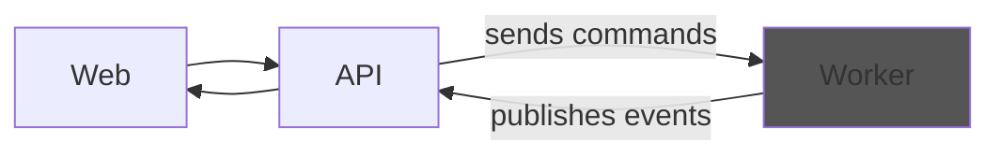
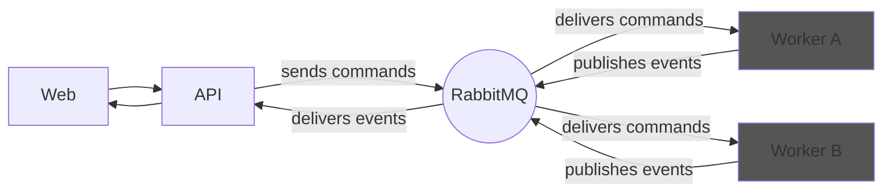

# Message-driven Service Architecture Templates

These templates scaffold a small message-driven system with a web frontend, an API, a worker, and a shared contracts project.

Here, MSA means Message-driven Service Architecture. Services exchange commands and events through a message broker, so they can be deployed and scaled independently.

[](https://github.com/ftechmax/msa-templates/actions/workflows/release.yml)
[](https://codecov.io/gh/ftechmax/msa-templates)

> [!NOTE]
> If you previously installed the now-retired `MSA.Templates` NuGet package, you can remove the stale local install with `dotnet new uninstall MSA.Templates`. The new flow does not use `dotnet new`.

## Why this exists

I've been building message-driven systems for about 15 years. Over time you end up rediscovering the same handful of patterns: how services talk to each other, how commands and events are modelled, how failures stay visible, and how you keep a system operable once it's running 24/7.

These templates are the accumulation of those lessons, packaged as a starting point:

- A clear split between the HTTP edge in the API and asynchronous domain work in the worker
- The messaging, persistence, caching, and telemetry stack I tend to reach for on a new project
- Kubernetes manifests for local, self-hosted, and cloud clusters
- Opinionated defaults you can rip out: every choice (Conveyo, PostgreSQL, Valkey, Server-Sent Events) is isolated behind its own wiring so you can swap one without touching the rest

This is not meant to be the only way to do things. It's the default I've shipped to production more than once.

## What you get

The templates fit together as a vertical slice of a message-driven system:

- **Shared** contains contracts and abstractions used by services in the same domain.
- **Worker** consumes commands and external events, applies business rules, persists state, and publishes domain outcomes.
- **API** exposes HTTP endpoints, validates input, sends commands to the worker, and forwards updates through Server-Sent Events (SSE).
- **Web** is an Angular frontend wired to the API.
- **Kubernetes manifests** deploy the API, worker, web app, PostgreSQL, and Valkey. See [the Kubernetes guide](docs/k8s.md) for the topology and cluster prerequisites.
- **krun** config file for usage with the [krun](https://github.com/ftechmax/krun) development tool.

The generated stack uses:

- Conveyo on RabbitMQ for messaging
- Npgsql and PostgreSQL JSONB for persistence; the Kubernetes manifests include a PostgreSQL StatefulSet
- Valkey through StackExchange.Redis for caching
- Server-Sent Events (SSE) for browser updates
- OpenTelemetry for traces, metrics, and logs

## Prerequisites

- [.NET SDK 10](https://dotnet.microsoft.com/download)
- [Node.js LTS](https://nodejs.org/) if you want to run or work on the generated Angular web app locally

## Quick start

Download the generator script from the [latest release](https://github.com/ftechmax/msa-templates/releases/latest) and run it. On its first run, the script downloads the matching `templates/` and `k8s/` bundle. To inspect the complete release first, use the zip instructions below.

**Bash (Linux/macOS):**

```sh
curl -fsSLO https://github.com/ftechmax/msa-templates/releases/latest/download/generator.sh && \
chmod +x generator.sh && \
./generator.sh
```

**PowerShell (Windows):**

```powershell
Invoke-WebRequest -Uri https://github.com/ftechmax/msa-templates/releases/latest/download/generator.ps1 -OutFile generator.ps1 ; `
.\generator.ps1
```

> ⚠️ Security note: the commands above will run a script pulled from the net. Convenient? Absolutely. Auditable? Not unless you read it first.

If you'd rather inspect everything before running (or generate on an air-gapped host), grab `msa-templates-vX.Y.Z.zip` from the [latest release](https://github.com/ftechmax/msa-templates/releases/latest), extract it, and run the script from inside:

**Bash:**

```sh
unzip msa-templates-v*.zip && cd msa-templates && ./generator.sh
```

**PowerShell:**

```powershell
Expand-Archive msa-templates-v*.zip ; cd msa-templates ; .\generator.ps1
```

The generator will walk you through the configuration interactively. Each prompt has an opinionated default between `[ ]`, so just press Enter to accept it:

```
MSA Generator vX.Y.Z
-------------------
Destination folder [~/git]: ~/git
Service name (PascalCase): AwesomeApp
Kubernetes namespace [default]:
RabbitMQ host [rabbitmq.rabbitmq-system.svc]:
Istio Gateway namespace [istio-ingress]:
Istio Gateway name [gateway]:
Base domain [kube.local]:
```

On PowerShell, the default destination folder is `C:/git` instead of `~/git`.

The generated folder has this structure:

```
awesome-app
|-- k8s
|   |-- base
|   `-- overlays
|       |-- api
|       |-- cache
|       |-- database
|       |-- web
|       `-- worker
|-- src
|   |-- api
|   |-- shared
|   |-- web
|   `-- worker
`-- krun.json
```

## After generation

Once generation finishes:

1. Open the generated folder and inspect the code in `src/` and the manifests in `k8s/`.
2. Read [docs/worker.md](docs/worker.md), [docs/api.md](docs/api.md), and [docs/web.md](docs/web.md) to find where to replace the example domain code.
3. Review [docs/k8s.md](docs/k8s.md) before applying the generated manifests. The `k8s/` folder assumes the platform services already exist in the cluster, typically installed via [msa-infrastructure](https://github.com/ftechmax/msa-infrastructure/) or equivalent.
4. If you use [krun](https://github.com/ftechmax/krun), use the generated `krun.json` as your local run configuration.

The generator creates code, manifests, and wiring. It does not start the stack for you.

## Worker

The worker consumes commands and events, runs domain logic, persists state, and publishes events that represent domain outcomes. It has bus retries and an error queue, and OpenTelemetry tracing across handlers.

See [the worker guide](docs/worker.md) for its project structure and handler patterns.


```mermaid
graph LR;
    Wb[Web]-->A[API];
    A-->Wb;
    A-- sends commands -->W;
    W[Worker]-- publishes events -->A;
    style W fill:#555
```

Larger systems often have several workers split by domain or bounded context. Each worker consumes its own commands, owns its state, and reacts to events from the others without sharing a database or calling them directly.

In this two-worker setup, the API sends commands through RabbitMQ and both workers publish events back. A worker can also subscribe to the other worker's events.


```mermaid
graph LR;
    Wb[Web]-->A[API];
    A-->Wb;

    A-- sends commands -->B((RabbitMQ));
    B-- delivers commands -->W1[Worker A];
    B-- delivers commands -->W2[Worker B];

    W1-- publishes events -->B;
    W2-- publishes events -->B;
    B-- delivers events -->A;

    style W1 fill:#555
    style W2 fill:#555
```

## API

The API is the HTTP edge. It validates input, serves a local read model, and forwards writes to the worker as commands. Events from the worker invalidate caches and reach browser clients through SSE.

See [the API guide](docs/api.md) for controllers, application services, and local event handling.

## Web

The Angular SPA runs in an Nginx container and uses [Transloco](https://jsverse.gitbook.io/transloco) for translations.

See [the web guide](docs/web.md) for SSE integration, translations, and event handling.

## How to contribute

Missing something? Open an issue or pull request.
