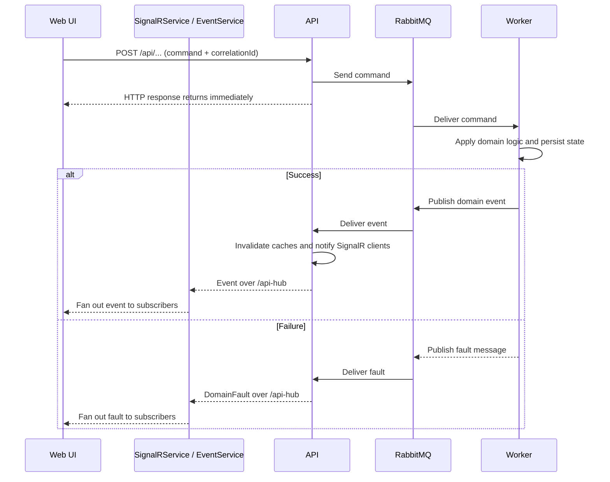

# Web project

The web template is a lightweight Angular SPA that is already wired to the rest of the stack: HTTP calls go to the API, real-time updates come in through SignalR, and the production build is served by Nginx.

It is intentionally simple. The goal is to give you a working shell that matches the API and worker templates without forcing a big frontend architecture on day one.

## What is included

The generated web project comes with:

- Angular using standalone configuration
- Angular Material for the base shell and navigation
- Transloco for localization
- SignalR client wiring for server-pushed updates
- a shared status service (`EventService`) that fans those updates out to the UI
- a small example feature to replace with your own domain
- an Nginx-based production container image

## Project shape

The template is organized around a few simple integration points:

- `src/app/app.routes.ts`
  - root routing and lazy loading for the example feature
- `src/app/layout/`
  - the application shell and navigation
- `src/app/example/`
  - example contracts, routes, and HTTP client code you are expected to replace
- `src/app/signalr.service.ts`
  - creates the SignalR connection and listens for events from the API
- `src/app/status.service.ts`
  - acts as a small in-memory event bus for published events and domain faults inside the SPA
- `public/i18n/`
  - translation files loaded by Transloco

## HTTP integration

The template expects the API to be exposed under `/api`.

The generated example client follows that convention directly:

- `GET /api/example/`
- `GET /api/example/{id}`
- `POST /api/example/`
- `PUT /api/example/{id}`

That matches the generated ingress setup, where the web app is served from `/` and API traffic is routed separately to `/api/`.

## SignalR integration

Real-time updates are wired through `/api-hub`.

The generated `SignalRService`:

- creates a connection to `/api-hub`
- subscribes to example events such as `ExampleCreatedEvent`
- forwards those events into `EventService`
- exposes fault notifications so the UI can correlate failures with a command

The app starts that connection once at the root, so the event stream is available to whichever screens are active.

This is intentionally straightforward. In a real app you will usually replace the example event names and group the subscriptions by feature or domain.

## Status service and domain feedback

`src/app/status.service.ts` is one of the most important pieces in the web template.

In code it is named `EventService`, but conceptually it is the app's shared status layer: a place where published events and domain faults are made available to the rest of the SPA without every component needing to know about SignalR.

That matters because commands in this stack are asynchronous.

For the server-side halves of the same loop, see [API async command loop](api.md#async-command-loop) and [Worker command handling and event publication](worker.md#command-handling-and-event-publication).

When the web app sends a command:

1. the browser calls the API over HTTP
2. the API validates the request and puts a command on RabbitMQ
3. the HTTP request returns quickly
4. the worker processes the command later
5. the worker publishes a resulting event that represents the domain outcome, or a fault if processing failed
6. the API forwards that outcome to the browser over SignalR
7. `SignalRService` pushes it into `EventService`
8. interested components react

The important bit is step 3: the HTTP response usually means "the command was accepted and queued", not "the business operation is complete".

Without the status service, the web layer would have no clean way to consume that later domain feedback.



### Why this pattern is useful

The status service gives you a clean separation of responsibilities:

- the HTTP client sends commands and performs queries
- `SignalRService` deals with the transport and hub message names
- `EventService` exposes an app-friendly stream of domain outcomes
- components subscribe only to the events they care about

This keeps the UI reactive without coupling every feature directly to SignalR internals.

It also scales nicely when more than one part of the UI cares about the same published event. A create form can react to success, a collection screen can refresh automatically, and a notification area can show a toast, all from the same event stream.

### Example flow in the template

The create example shows the intended shape particularly well:

1. the form generates a `correlationId`
2. that `correlationId` is sent with the command payload
3. the HTTP call returns immediately after the API accepts the command
4. the component stays subscribed to `ExampleCreatedEvent` and `CreateExampleFault`
5. when an event comes back with the same `correlationId`, the UI knows it is the outcome of that specific user action

That lets the screen respond to real domain outcomes instead of pretending the POST response was the final truth.

In the template:

- the create component listens for `ExampleCreatedEvent` and navigates when the matching event arrives
- the create component also listens for `CreateExampleFault` and shows a snackbar when processing fails
- the collection component merges `ExampleCreatedEvent` into its reload stream so lists refresh when a create command eventually succeeds

This is the core idea of the web template: user actions are immediate, domain results are eventual, and the UI stays honest about that.

### Correlation IDs

Correlation IDs are what make this practical.

Because many users and many commands may be in flight at once, the browser needs a way to match "this event" back to "that button click". The template does that by sending a correlation ID with the command and expecting the eventual event or fault to carry it back.

That is why the status service is not just a convenience wrapper. It is the piece that allows the web app to consume domain-level feedback in a message-driven system without blocking on synchronous request/response semantics that do not really exist here.

### How to extend it

As you replace the example domain, the usual pattern is:

1. add event and fault types to your contracts
2. add matching `Subject`s to `EventService`
3. register the corresponding SignalR handlers in `SignalRService`
4. subscribe from the components, stores, or feature services that care about those outcomes

Try to keep the responsibilities split the same way:

- `SignalRService` should translate transport messages into app events
- `EventService` should be the shared fan-out point
- feature code should react to domain outcomes, not parse hub wiring

If you keep that boundary, the web app remains easy to evolve even when the number of commands, events, and screens grows.

## Translations

Translations are handled through Transloco.

- available languages are configured in `src/app/app.config.ts`
- translation files live in `public/i18n/`
- the template starts with English only

If you add more languages, update both the translation files and the Transloco configuration.

## Running locally

From the generated `src/web` folder:

```sh
npm ci
npx ng serve --proxy-config proxy.config.json
```

The proxy forwards `/api` and `/api-hub` to the generated service host so you can develop the frontend without changing the app code.

If your API is not reachable at the default host in `proxy.config.json`, update that file to match your environment before starting the dev server.

To create a production build:

```sh
npm run build
```

## Production container

The template includes a multi-stage Docker build:

1. build the Angular app with Node
2. serve the compiled assets from Nginx

The default Nginx config uses SPA-style fallback routing so deep links resolve to `index.html` instead of returning 404s.

## Replacing the example domain

The first cleanup pass after generation is usually:

1. replace the example contracts in `src/app/example/contracts.ts`
2. replace the example HTTP client in `src/app/example/httpclient.ts`
3. replace the example routes and components with your real feature flow
4. rename the SignalR event listeners in `src/app/signalr.service.ts`
5. adjust the subjects in `src/app/status.service.ts`

Once those pieces are updated, the web template becomes a normal Angular app that just happens to start with the right wiring for this message-driven stack.
