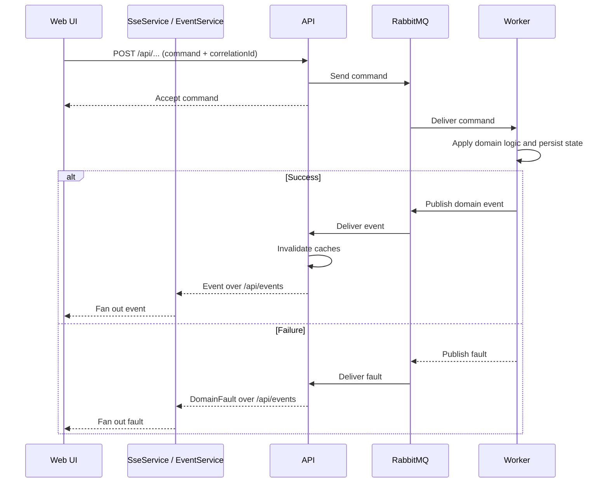

# Web project

The web template is an Angular SPA connected to the rest of the stack. HTTP calls go to the API, Server-Sent Events (SSE) carry asynchronous results back, and Nginx serves the production build.

It includes the API and worker integration but does not add a global state library or a feature architecture.

## What is included

- Angular with standalone configuration
- Angular Material for the application shell and navigation
- Transloco for translations
- a native `EventSource` client for SSE updates
- `EventService`, an in-memory fan-out point for domain events and faults
- an example feature to replace with your domain
- an Nginx production image

## Project structure

- `src/app/app.routes.ts` defines root routes and lazy-loads the example feature.
- `src/app/layout/` contains the application shell and navigation.
- `src/app/example/` contains example contracts, routes, components, and an HTTP client.
- `src/app/sse.service.ts` opens the SSE connection and listens for named API events.
- `src/app/status.service.ts` contains `EventService`, which exposes domain events and faults inside the SPA.
- `public/i18n/` contains Transloco translation files.

## HTTP integration

The web app expects the API under `/api`. Its example client calls:

- `GET /api/example/`
- `GET /api/example/{id}`
- `POST /api/example/`
- `PUT /api/example/{id}`

The ingress sends `/` to the web app and rewrites `/api/` requests for the API.

## Server-Sent Events

`SseService` opens a native `EventSource` connection to `/api/events`. It listens for named messages such as `ExampleCreatedEvent`, then passes events and faults to `EventService`.

The root component opens one connection for the whole app. SSE only sends data from server to client, and the browser reconnects after a dropped connection without an extra client library.

Rename the example listeners when you replace the example domain. In a larger app, group them by feature or domain.

## Asynchronous command results

The file `src/app/status.service.ts` defines `EventService`, the UI-side entry point for domain outcomes. Components subscribe to it instead of opening their own SSE connections.

See [the API command loop](api.md#async-command-loop) and [worker command handling](worker.md#command-handling-and-event-publication) for the server-side parts of this flow.


```mermaid
sequenceDiagram
    participant UI as Web UI
    participant ES as SseService / EventService
    participant API as API
    participant MQ as RabbitMQ
    participant Worker as Worker

    UI->>API: POST /api/... (command + correlationId)
    API->>MQ: Send command
    API-->>UI: Accept command
    MQ->>Worker: Deliver command
    Worker->>Worker: Apply domain logic and persist state

    alt Success
        Worker->>MQ: Publish domain event
        MQ->>API: Deliver event
        API->>API: Invalidate caches
        API-->>ES: Event over /api/events
        ES-->>UI: Fan out event
    else Failure
        Worker-->>MQ: Publish fault
        MQ->>API: Deliver fault
        API-->>ES: DomainFault over /api/events
        ES-->>UI: Fan out fault
    end
```

The HTTP response confirms that the API accepted the command. The event or fault that arrives over SSE is the business result.

### Correlation IDs

Several commands may be in flight at once. A correlation ID lets the browser match an incoming event or fault to the action that caused it.

The example create form generates a `correlationId` and includes it in the command. The worker preserves that ID on the published event, and the API includes it in the SSE message. The create component reacts only when the returned ID matches its command.

On success, the form navigates and the collection component reloads its data. On failure, the form shows a snackbar. Other components can react to the same event without knowing how SSE transports it.

### Service boundaries

- The HTTP client sends commands and runs queries.
- `SseService` owns the connection and event names.
- `EventService` exposes shared streams of domain outcomes.
- Components and feature services react to those outcomes.

Keep transport parsing in `SseService`. Feature code should not inspect raw SSE messages.

## Replacing the example domain

Start with these files:

1. Replace the example contracts in `src/app/example/contracts.ts`.
2. Replace the HTTP calls in `src/app/example/httpclient.ts`.
3. Add routes and components for the real feature.
4. Rename the listeners in `src/app/sse.service.ts`.
5. Replace the example `Subject`s in `src/app/status.service.ts` and update their subscribers.

Once those pieces match your contracts, the rest is a standard Angular app.

## Translations

Transloco loads translations from `public/i18n/`. The template starts with English, and `src/app/app.config.ts` lists the available languages. Update both locations when adding a language.

## Running locally

From the generated `src/web` folder:

```sh
npm ci
npx ng serve --proxy-config proxy.config.json
```

The proxy sends `/api`, including the `/api/events` stream, to the generated service host. If that host is not reachable, change it in `proxy.config.json` before starting the development server.

Create a production build with:

```sh
npm run build
```

## Production container

The multi-stage Docker build compiles the Angular app with Node and copies the output into an Nginx image. Nginx falls back to `index.html` for SPA routes, so opening a deep link does not return a 404.
